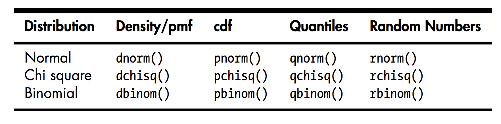

# Repaso de la clase anterior

## Funciones matemáticas básicas

    - exp(): función exponencial, base e
    - log(): logaritmo natural 
    - log10(): logaritmo base 10
    - sqrt(): raiz cuadrada
    - abs(): valor absoluto
    - sin(), cos(), etc.: funciones trigonométricas
    - min(),  max(): valor mínimo y máximo de un vector
    - which.min() and which.max(): índice del valor mínimo y máximo 
    - pmin() and pmax(): mínimos y máximos para varios vectores, por elemento
    - sum() and prod(): suma y producto de elementos de vectores
    - cumsum() and cumprod(): suma acumulada y producto acumulado de elementos de vectores
    - round(), floor(), and ceiling(): redondeo al entero más próximo, al menor o al mayor, respectivamente
    - factorial(): función factorial
    - %%: operador módulo y %/%: operador división por enteros

    x <- c(12,5,13)
    cumsum(x)
    # [1] 12 17 30
    cumprod(x)
    # [1] 12 60 780

## Cálculo

R tiene capacidades tanto para hacer cálculos numéricos como analíticos:

    # derivada analítica
    D(expression(exp(x^2)),"x")  
    exp(x^2) * (2 * x)
    # integral numérica
    integrate(function(x) x^2,0,1) 
    0.3333333 with absolute error < 3.7e-15

Existen paquetes para ecuaciones diferenciales (`odesolve`), y para
extender la capacidad simbólica usando el sistema Yacas
(`ryacas`). Ver CRAN.

## Álgebra Lineal

     # Multiplicación de matrices: Directamente con el operador %*%: 
    - a %*% b
     # Sistema de ecuaciones lineales (o invertir una matriz) con ~solve()~
    - solve(a,b) ## resuelve el sistema de ecuaciones
    - solve(a) ## sin el segundo argumento, invierte la matriz
    # Autovectores y autovalores
    - eigen(a)
    # Otras operaciones posibles:
    - t(): # transpuesta de una matriz
    - qr(): # descomposición QR
    - chol(): # descompocisión Cholesky
    - det(): # Determinante
    - eigen(): # Autovalores/autovectores
    - diag(): # extrae la diagonal de una matriz cuadrada
    - svd(A): # descomposición en valores singulares
    - ...

## Estadística descriptiva

Conceptos para entender la estructura de un grupo (digamos, `N > 30`) de datos. 

Una manera de hacer estadística descriptiva en columnas de listas (o data.frames) es con `sapply`:

    sapply(mydata, mean, na.rm=TRUE) 

donde podemos usar `mean`, `sd`, `var`, `min`, `max`, `median`, `range`, o `quantile`, entre otras). 

O `summary()`, que es equivalente y funciona con data.frames.

Tenemos también `group_by() + summarise()` con las mismas funciones básicas.

## Distribuciones

En general R usa la siguiente convención:

-   `dDIST(x, ...)` es la función distribución de probabilidad (PDF). Devuelve la prob. de observar un
    valor x
-   `pDIST(x, ...)` es la función cumulativa de probabilidad (CDF). Devuelve la prob. de obervar un
    valor menor a x (mayor si usamos `lower.tail=F`)
-   `rDIST(n, ...)` es un generador de números aleatorios que devuelve n valores sacados de una distr. DIST.
-   `qDIST(p, ...)` es la función cuartil que devuelve el x que corresponde al percentil `p` de DIST. Si
    `lower.tail=F`, devuelve `1` menos `p`.

Para ver las distribuciones disponibles, ver el [task view de distribuciones](https://cran.r-project.org/web/views/Distributions.html)

## Modelado estadístico

Modelado se refiere a proponer determinadas relaciones entre variables, típicamente cuál es la
relación entre una variable dependiente o *variable respuesta* y otras variables independientes o
*variables explicativas*. 

En R la función `lm()` se usa para regresión lineal (*linear models*) y `glm()` para *generalized linear models*.

## Regresión lineal - `lm()`

Construimos un "modelo" (una relación) entre variables dependientes e independientes optimizando
parámetros para poder predecir.
1 - Propongo una determinada relación de variables (a través de una 'formula' tipo `y \` x~).
2 - Calculo coeficientes del modelo (los consulto con `coef()` ).
3 - Compruebo que tan bien se ajusta el modelo a nuevas observaciones (con `predict()`).

    y[i] ~ f(x[i,]) = b[1] x[i,1] + ... b[n] x[i,n]
    ## b[i] son los coeficientes o betas

## Regresión lineal generalizada - `glm()`

Los modelos lineales asumen que el valor predicho es continuo y que los errores van a ser
"normales". Los modelos lineales generalizados relajan estas suposiciones.

    ## expresión general
    glm(formula, family=familytype(link=linkfunction), data=)

Ejemplito: Regresión logística, para variables categóricas.

    # F es un factor binario
    # x1, x2 y x3 son predictores continuos 
    fit <- glm(F~x1+x2+x3,data=mydata,family=binomial())
    summary(fit) # resultados
    exp(coef(fit)) # coeficientes
    predict(fit, type="response") # predicciones
    residuals(fit, type="deviance") # residuos 

# Jupyter Notebooks

-   Un *Jupyter Notebook* (antes llamadas *IPython Notebooks*) es un ambiente computacional basado en la web (a través de servers), interactivo, para crear documentos tipo *notebook*.
-   Basados en el estilo 'Mathematica', primero aparecieron para Python, ahora hay para muchos lenguajes, entre ellos R.
-   Se puede hacer gran parte de lo que hacemos en Rstudio, pero en un navegador.
-   Algunos links útiles:
    -   [Try Jupyter](https://jupyter.org/try)
    -   [What is the Jupyter Notebook?](https://jupyter-notebook-beginner-guide.readthedocs.io/en/latest/what_is_jupyter.html)

# R y bases de datos

R puede acceder a distintos tipos de bases de datos (DBMSs - Database Management Systems): Microsoft
SQL Server, Microsoft Access, MySQL, Oracle, PostgreSQL, DB2 de IBM, Sybase, Teradata, and SQLite.

Se puede 'hablar' con estas bases de datos con interfaces (protocolos) como ODBC con el paquete
RODBC. Existen otras alternativas, por ejemplo, JODBC, RMySQL, ROracle, RPostgreSQL y RSQLite.

-   Ejemplo con RODBC. Asegurarse de instalar el paquete y los drivers OBDC correspondientes.

    library(RODBC)
    ?RODBC
    ## abro una conexión a la base de datos OBDC
    myconn <-odbcConnect("mydsn", uid="Rob", pwd="aardvark")
    ## bajo datos
    crimedat <- sqlFetch(myconn, Crime)
    ## hago una 'query': selecciono todo de la tabla Punishment
    pundat <- sqlQuery(myconn, "select * from Punishment")
    ## cierro conexión
    close(myconn)

# Strings

El paquete [`stringr`](https://stringr.tidyverse.org/reference/index.html) del `tidyverse` se usa para manipulación de *strings* o caracteres. 

    library(stringr)
    s1 <- "Esto es un string"
    s2 <- 'podemos usar "comillas" dentro de un string, con comillas simples'
    s3 <- 'podemos usar una comilla simple \" anteponiendo una barra, se dice "escapar" la comilla'
    s3 # así mostramos el string
    writeLines(s3) # así lo podemos imprimir sin que salgan las barras
    writeLines("\tUn tab y un enter\n") # existen algunos otros comandos especiales
    c("uno", "dos", "tres") # esto es un vector de caracteres o strings

## Funciones básicas de `stringr`

Casi todas las funciones de `stringr` empiezan con "str\_". Pueden verlas con `apropos("str_")`.

    str_length(c("a", "Curso de R 2019", NA))
    [1]  1 15 NA
    str_c("x", "y")
    [1] "xy"
    ## podemos elegir el /string/ separador
    str_c("x", "y", sep = "---")
    [1] "x---y"
    ## si no queremos NA's
    str_replace_na( c("abc", NA)) 
    [1] "abc" "NA" 
    ## str_c() es vectorizada    
    str_c("^", c("a", "b", "c"), "$")  
    [1] "^a$" "^b$" "^c$"
    ## si queremos juntar todos los elementos en uno solo
    str_c(c("a", "b", "c"), collapse=" ") 
    [1] "a b c"
    ## subsetting
    x <- c("Rojo", "Azul", "Amarillo")
    str_sub(x, 1, 3)
    [1] "Roj" "Azu" "Ama"

El paquete contiene los vectores `words` y `sentences` que pueden usar para practicar.

## Expresiones regulares y `stringr`

Expresiones regulares (*regexp*) son un lenguaje para detectar patrones en strings. La idea es poder codificar un *patrón* e inspeccionar un string para ver si lo contiene o no. Ejemplos: una parte de un string, que el string comience o termine con determinado caracter, etc. Las *regexps* son **muy** maleables y `stringr` las acepta en muchas de sus funciones.

    x <- c("rojo", "azul", "amarillo")
    str_view(x, "am") ## abre una ventana y muestra donde hay occurrencia de "am"
    str_view(x, ".o.") ## idem pero usando el punto, que significa 'cualquier caracter'
    str_view(x, "^a") ## palabras que empiezan con a
    str_view(x, "o$") ## palabras que terminan con o
    str_detect(x, ".z.")
    sum(str_detect(x, "a$"))
    str_replace(x, "[aeiou]", "-")
    sentences %>% head(5) %>% str_split(" ")

Más en [R for Data Science - sección 14.3](https://r4ds.had.co.nz/strings.html#matching-patterns-with-regular-expressions)

# Dates con `lubridate`

Las fechas se almacenan como "date" o como "date-time" (fecha más hora). En `tibbles` se muestran como `<date>` o `<dttm>`. 

    today()
    now()
    ## podemos crear estructuras tipo dates con strings
    ymd("2019-04-22")
    mdy("April 22st, 2019")
    dmy("22-Apr-2019")
    ## o con números
    ymd(20190422)
    
    ## podemos crear date-times
    ymd_hms("2019-04-22 16:01:23")
    mdy_hm("04/22/2019 16:01")
    ## manejamos husos horarios con el argumento 'tz'
    ymd(20190422, tz = "UTC")
    
    library(nycflights13)
    ## podemos crear date-times a partir de sus partes
    flights %>% 
      select(year, month, day, hour, minute) %>% 
      mutate(departure = make_datetime(year, month, day, hour, minute))
    ## tenemos la familia as_
    as_datetime(today())
    as_date(now())
    as_datetime(60 * 60 * 10)
    as_date(365 * 10 + 2)
    
    ## Para obtener las partes tenemos:
    datetime <- ymd_hms("2019-04-22 16:01:48")
    year(datetime)
    month(datetime)
    mday(datetime)
    yday(datetime)
    wday(datetime)

# Intervalos de tiempo

Hay tres importantes: duraciones (un número exacto de segundos), períodos (diferencias de tiempos en semanas o meses) e intervalos (representados por su inicio y fin).

    cuanto <- today() - ymd(20190101) ## como período
    as.duration(cuanto) ## como duración
    
    ## constructores de duración
    dseconds(15)
    dhours(c(12, 24)) ## vetorizado
    dyears(1) + dweeks(12) + dhours(15) ## como duración
    tom <- today() + ddays(1)
    
    ## constructores de período
    seconds(15)
    hours(c(12, 24))
    days(50) + hours(25) + minutes(2)
    ymd("2019-04-22") + years(1)
    
    ## intervalos
    years(1) / days(1)
    (today() %--% next_year) / ddays(1)
    
    ## Huso horario
    Sys.timezone()
    ymd_hms("2015-06-01 12:00:00", tz = "America/Buenos_Aires")

# Práctica 10

Descargar [práctica 10](../assets/R2019-practice-10-t9jw92tiaj.pdf).

